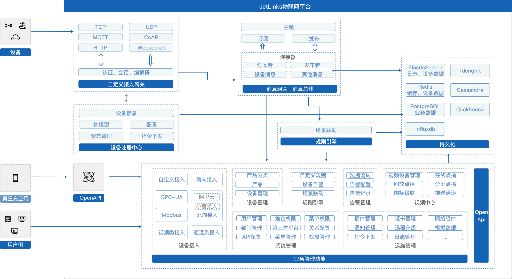
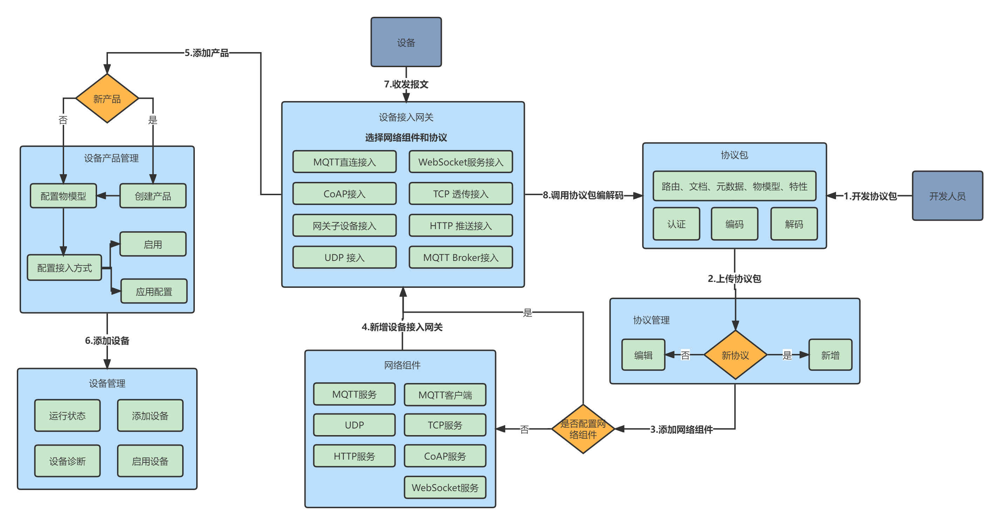

# JetLinks 物联网基础平台


[](https://app.codacy.com/gh/jetlinks/jetlinks-community?utm_source=github.com&utm_medium=referral&utm_content=jetlinks/jetlinks-community&utm_campaign=Badge_Grade_Settings)
[](https://www.oscs1024.com/project/jetlinks/jetlinks-community?ref=badge_small)
[](https://github.com/jetlinks/jetlinks-community)
[](https://gitee.com/jetlinks/jetlinks-community/stargazers)

[](https://qm.qq.com/cgi-bin/qm/qr?k=jiirLiyFUecy_gsankzVQ-cl6SrZCnv9&&jump_from=webapi)
[](https://qm.qq.com/cgi-bin/qm/qr?k=Gj47w9kg7TlV5ceD5Bqew_M_O0PIjh_l&jump_from=webapi)
[](https://qm.qq.com/cgi-bin/qm/qr?k=K5m27CkhDn3B_Owr-g6rfiTBC5DKEY59&jump_from=webapi)
[](https://qm.qq.com/cgi-bin/qm/qr?k=IMas2cH-TNsYxUcY8lRbsXqPnA2sGHYQ&jump_from=webapi)
[](https://qm.qq.com/cgi-bin/qm/qr?k=LGf0OPQqvLGdJIZST3VTcypdVWhdfAOG&jump_from=webapi)

JetLinks 基于Java8,Spring Boot 2.x,WebFlux,Netty,Vert.x,Reactor等开发, 
是一个开箱即用,可二次开发的企业级物联网基础平台。平台实现了物联网相关的众多基础功能,
能帮助你快速建立物联网相关业务系统。
 

## 核心特性

#### 开放源代码

全部源代码开放,可自由拓展功能,不再受制于人.前后端分离,接口全开放。

#### 统一设备接入,海量设备管理
TCP/UDP/MQTT/HTTP、TLS/DTLS、不同厂商、不同设备、不同报文、统一接入，统一管理。

#### 规则引擎
灵活的规则模型配置,支持多种规则模型以及自定义规则模型. 设备告警,场景联动,均由统一的规则引擎管理。

#### 数据权限控制
灵活的非侵入数据权限控制。可实现菜单、按钮、数据三维维度的数据权限控制。可控制单条数据的操作权限。

## 技术栈

1. [Spring Boot 2.7.x](https://spring.io/projects/spring-boot)
2. [Spring WebFlux](https://spring.io/) 响应式Web支持
3. [R2DBC](https://r2dbc.io/) 响应式关系型数据库驱动
4. [Project Reactor](https://projectreactor.io/) 响应式编程框架
4. [Netty](https://netty.io/),[Vert.x](https://vertx.io/) 高性能网络编程框架
5. [ElasticSearch](https://www.elastic.co/cn/products/enterprise-search) 全文检索，日志，时序数据存储
6. [PostgreSQL](https://www.postgresql.org) 业务功能数据管理
7. [hsweb framework 4](https://github.com/hs-web) 业务功能基础框架

## 架构



## 设备接入流程



## 模块

```bash
--jetlinks-community
------|----docker
------|------|----dev-env       # 启动开发环境
------|------|----run-all       # 启动全部,通过http://localhost:9000 访问系统.
------|----jetlinks-components  # 公共组件模块
------|-------|----common-component # 通用组件.
------|-------|----configuration-component # 通用配置.
------|-------|----dashboard-component # 仪表盘.
------|-------|----datasource-component # 数据源.
------|-------|----elasticsearch-component # elasticsearch集成.
------|-------|----gateway-component # 网关组件,消息网关,设备接入.
------|-------|----io-component # IO 组件,Excel导入导出等.
------|-------|----logging-component # 日志组件
------|-------|----network-component # 网络组件,MQTT,TCP,CoAP,UDP等
------|-------|----notify-component # 通知组件,短信,右键等通知
------|-------|----protocol-component # 协议组件
------|-------|----relation-component # 关系组件
------|-------|----rule-engine-component # 规则引擎
------|-------|----script-component # 脚本组件
------|-------|----timeseries-component # 时序数据组件
------|-------|----tdengine-component # TDengine集成
------|-------|----things-component # 物组件
------|----jetlinks-manager     # 业务管理模块
------|-------|----authentication-manager   # 用户,权限管理
------|-------|----device-manager   # 设备管理
------|-------|----logging-manager   # 日志管理
------|-------|----network-manager   # 网络组件管理
------|-------|----notify-manager   # 通知管理
------|-------|----visualization-manager   # 数据可视化管理
------|-------|----rule-engine-manager   # 规则引擎管理
------|----jetlinks-standalone  # 服务启动模块
------|----simulator            # 设备模拟器
```


## 服务支持

我们提供了各种服务方式帮助您深入了解物联网平台和代码，通过产品文档、技术交流群、付费教学等方式，你将获得如下服务：


| 服务项       | 服务内容              | 服务收费   | 服务方式   |
|-----------|-----------------|--------|-------------|
| 基础问题答疑    | 问题答疑  | 免费     | 技术交流群支持 [](https://qm.qq.com/cgi-bin/qm/qr?k=jiirLiyFUecy_gsankzVQ-cl6SrZCnv9&&jump_from=webapi) [](https://qm.qq.com/cgi-bin/qm/qr?k=Gj47w9kg7TlV5ceD5Bqew_M_O0PIjh_l&jump_from=webapi) [](https://qm.qq.com/cgi-bin/qm/qr?k=K5m27CkhDn3B_Owr-g6rfiTBC5DKEY59&jump_from=webapi)  [](https://qm.qq.com/cgi-bin/qm/qr?k=IMas2cH-TNsYxUcY8lRbsXqPnA2sGHYQ&jump_from=webapi) [](https://qm.qq.com/cgi-bin/qm/qr?k=LGf0OPQqvLGdJIZST3VTcypdVWhdfAOG&jump_from=webapi) |
| 系统部署      | 系统部署     | 免费     | 文档自助。[源码部署](https://hanta.yuque.com/px7kg1/yfac2l/vvoa3u2ztymtp4oh) [Docker部署](https://hanta.yuque.com/px7kg1/yfac2l/mzq23z4iey5ev1a5)  |
| 产品使用      | 教学产品各功能使用   | 免费     | 文档自助。[产品文档](https://hanta.yuque.com/px7kg1/yfac2l) |
| 二次开发      | 教学平台源码开发过程、工具使用等；| 免费     | 文档自助。[开发文档](https://hanta.yuque.com/px7kg1/nn1gdr)  |
| 系统部署      | 在客户指定的网络和硬件环境中完成社区版服务部署；提供**模拟**设备接入到平台中，并能完成正常设备上线、数据上下行 | 199元   | 线上部署支持   |
| 技术支持      | 提供各类部署、功能使用中遇到的问题答疑  | 100    | 半小时内 线上远程支持|
| 设备接入协议开发  | 根据提供的设备型号，编写并提供接入平台协议包的源码。| 3000+元 | 定制化开发  |
| 硬件支持    |  提供JetLinks自有硬件邮寄到手（JetLinks DTU、报警器、温度传感器）；并提供完整的接入视频文档  | 699元   | 硬件包邮<br /> [视频文档](https://hanta.yuque.com/px7kg1/yfac2l/pgi0eydsmlyb7q1w)|
| 其他服务 | 企业版源码购买；定制化开发；定制化时长、功能服务等 | 面议     | 面议 |

### **付费**服务支持或商务合作请联系


## 文档


[产品文档](https://hanta.yuque.com/px7kg1/yfac2l)
[快速开始](https://hanta.yuque.com/px7kg1/yfac2l/raspyc4p1asfuxks)
[开发文档](https://hanta.yuque.com/px7kg1/nn1gdr)
