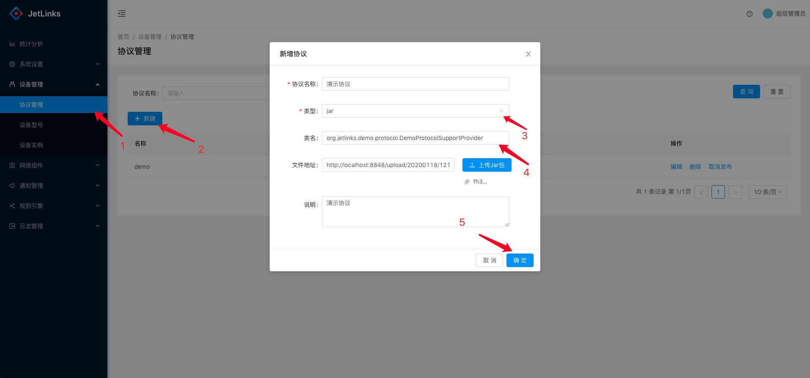
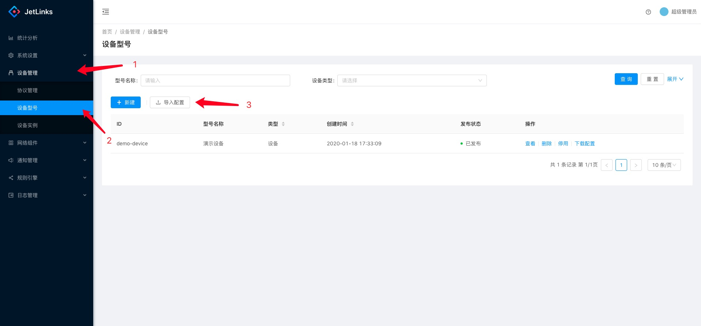
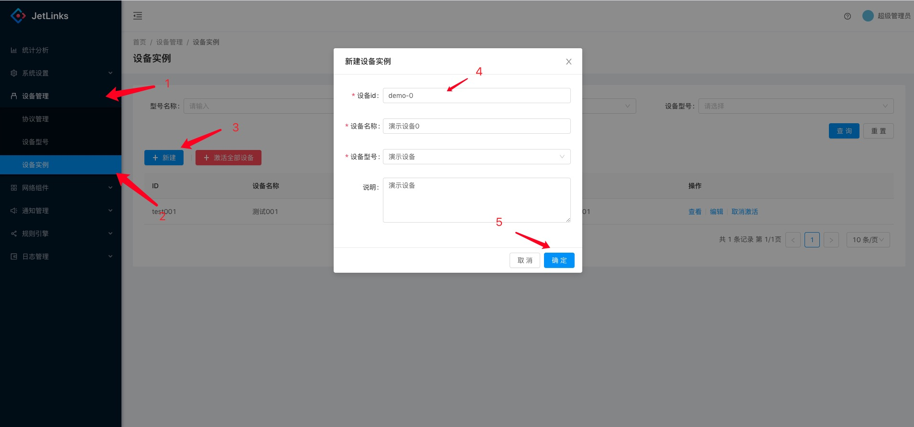
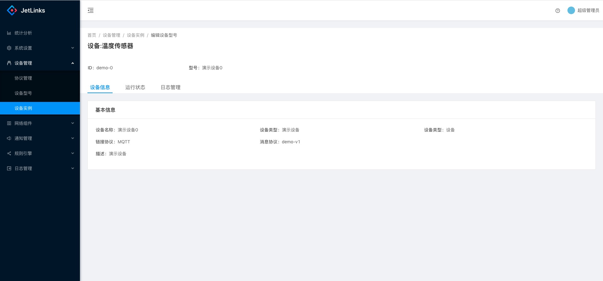
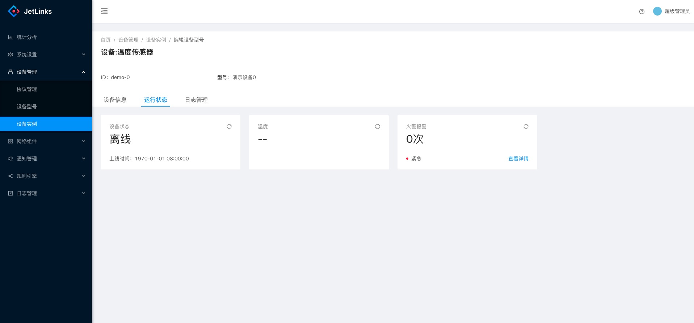
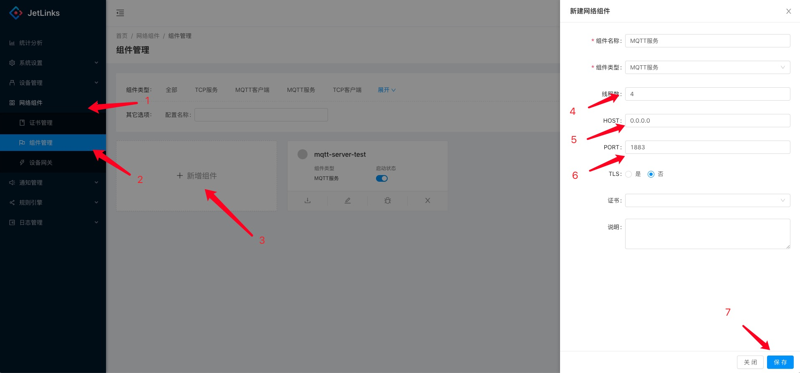
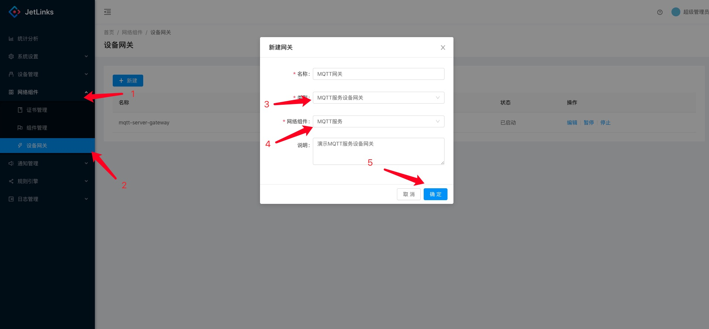

# 快速开始

### 下载代码:

```bash

$ git clone https://github.com/jetlinks/jetlinks-community.git && cd jetlinks-community

```

### 启动

方式1: 使用docker快速启动全部环境.
```bash

$ cd docker/run-all
$ docker-compose up

```

方式2: 使用docker启动开发环境,使用IDE启动`JetLinks`服务.

步骤1: 启动环境

```bash
$ cd docker/dev-env
$ docker-compose up
```

步骤2: 启动JetLinks服务

项目导入IDE后执行`jetlinks-standalone`模块下的`org.jetlinks.community.standalone.JetLinksApplication`

步骤3: 启动UI

可以通过[UI源码](https://github.com/jetlinks/jetlinks-ui-antd)自行构建.

或者使用docker启动UI:

```bash
$ docker run -it --rm -p 9000:80 -e "API_BASE_PATH=http://host.docker.internal:8848/" registry.cn-shenzhen.aliyuncs.com/jetlinks/jetlinks-ui-antd
```

⚠️: 环境变量`API_BASE_PATH`为后台API根地址. 由docker容器内进行自动代理. 请根据自己的系统环境配置环境变量: `API_BASE_PATH`
 
 
方式3: 自行启动所需环境:`postgresql`,`redis`,`elasticsearch`.

步骤1: 根据情况修改配置文件:`application.yml`中相关配置.

```yaml
spring:
  redis:
    host: 127.0.0.1 # redis配置
    port: 6379
  r2dbc:
    url: r2dbc:postgresql://127.0.0.1:5432/jetlinks  # 数据库postgresql数据库配置
    username: postgres
    password: jetlinks

elasticsearch:
  client:
    host: 127.0.0.1   # elasticsearch
    port: 9200
hsweb:
  file:
    upload:
      static-file-path: ./static/upload   # 上传的文件存储路径
      static-location: http://127.0.0.1:8844/upload # 上传的文件访问根地址

```

步骤2: 从`方式2`-`步骤2`开始.


### 启动成功后访问系统

地址: `http://localhost:9000`, 用户名:`admin`,密码:`admin`.

### 添加协议

进入`设备管理`-`协议管理`,点击`新建`.

- 协议名称: `演示协议`.
- 类型: `jar`.
- 类名: `org.jetlinks.demo.protocol.DemoProtocolSupportProvider`
- 上传jar包: 选择项目内文件: `simulator/demo-protocol-1.0.jar`



### 添加设备型号

进入`设备管理`-`型号管理`,点击`导入配置`. 选择项目内文件: `simulator/设备型号-演示设备.json`.



导入成功后,点击`操作列`-`发布`,如果状态为`已发布`,则点击`停用`后重新发布.


### 添加设备实例

进入`设备管理`-`设备实例`,点击`新建`.

- 设备id: `demo-0`
- 设备名称: `演示设备0`
- 设备型号: `演示设备`



点击确定,保存成功后, 点击`操作列`-`激活`. 点击`查看`可查看设备的基本信息以及`运行状态`

设备基本信息



运行状态




### 启动MQTT服务

进入`网络组件`-`组件管理`,点击`新增组件`.

- 组件名称: `MQTT服务`
- 组件类型: `MQTT服务`
- 线程数: `4` 可根据实际情况调整,一般`不大于主机CPU核心数*2`
- HOST: `0.0.0.0`
- PORT: `1883`
- TLS: `否`



点击保存,保存成功后,点击`启动状态`切换启动状态为启动.


### 启动设备网关

进入`网络组件`-`设备网关`,点击`新建`.

- 名称: `MQTT网关`
- 类型: `MQTT服务设备网关`
- 网络组件: `MQTT服务` 选择上一步创建的网络组件



点击确定,保存成功后,点击操作列中的`启动`.

### 启动模拟器

进入项目目录:`simulator`.

```bash
   $ cd simulator
   $ ./start.sh
```

启动成功后控制台应该会输出:

```text
...
create mqtt client: 1 ok
...
开始上报设备事件
成功推送设备事件:1

```

### 查看设备数据

进入`设备实例`,点击查看`demo-0`设备,点击`运行状态`,可看到设备上报的数据.

